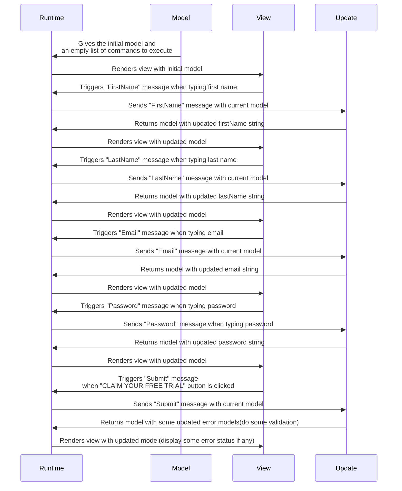

# How signup-form works:

```mermaid

sequenceDiagram
    participant Runtime
    participant Model
    participant View
    participant Update

    Model->>Runtime: Gives the initial model and<br/>an empty list of commands to execute
    Runtime->>View: Renders view with initial model

    View->>Runtime: Triggers "FirstName" message when typing first name
    Runtime->>Update: Sends "FirstName" message with current model
    Update->>Runtime: Returns model with updated firstName string
    Runtime->>View: Renders view with updated model

    View->>Runtime: Triggers "LastName" message when typing last name
    Runtime->>Update: Sends "LastName" message with current model
    Update->>Runtime: Returns model with updated lastName string
    Runtime->>View: Renders view with updated model

    View->>Runtime: Triggers "Email" message when typing email
    Runtime->>Update: Sends "Email" message with current model
    Update->>Runtime: Returns model with updated email string
    Runtime->>View: Renders view with updated model

    View->>Runtime: Triggers "Password" message when typing password
    Runtime->>Update: Sends "Password" message when typing password
    Update->>Runtime: Returns model with updated password string
    Runtime->>View: Renders view with updated model

    View->>Runtime: Triggers "Submit" message<br />when "CLAIM YOUR FREE TRIAL" button is clicked
    Runtime->>Update: Sends "Submit" message with current model
    Update->>Runtime: Returns model with some updated error models(do some validation)
    Runtime->>View: Renders view with updated model(display some error status if any)
```
